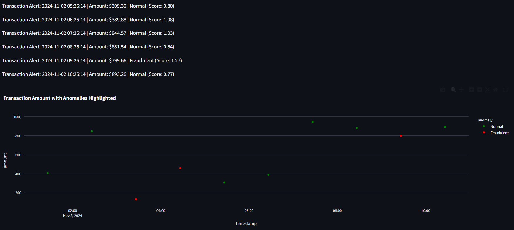

# FraudHawk

## Overview

**FraudHawk** is an advanced anomaly detection project designed to monitor user transactions and identify fraudulent activities in real-time. By leveraging machine learning techniques such as Autoencoders and Isolation Forest, FraudHawk provides a robust framework for ensuring transaction integrity, enhancing user trust, and minimizing financial losses due to fraud.




## Features

- **Real-time Transaction Monitoring:** Detects and alerts users about potentially fraudulent transactions as they occur.
- **Flexible Input Format:** Supports CSV file uploads with transaction details including timestamps, amounts, categories, and transaction types (online/onsite).
- **Anomaly Detection Models:** Utilizes both Autoencoders and Isolation Forests for identifying anomalies, providing a comparative analysis of both approaches.
- **User-friendly Dashboard:** Visualizes transaction histories and highlights anomalies using interactive plots.

## Methodology

### Anomaly Detection Techniques

**1. Autoencoders:**
   - **Pros:**
     - Effective for high-dimensional data.
     - Learns complex patterns and reconstructs inputs, highlighting anomalies based on reconstruction error.
     - Can handle various types of data seamlessly.
   - **Cons:**
     - Requires careful tuning of architecture and hyperparameters.
     - May need substantial computational resources for training.

**2. Isolation Forest:**
   - **Pros:**
     - Efficient in terms of both speed and memory usage.
     - Well-suited for detecting anomalies in large datasets with high-dimensional features.
     - Simple to implement and interpret.
   - **Cons:**
     - Assumes that anomalies are few and differ significantly from the normal observations.
     - Less effective if the data has a uniform distribution.
    
## Usage

Upload your transaction data in CSV format.
Choose to start transaction simulation to monitor for anomalies.
View real-time alerts and visualizations on the dashboard.

## Installation

To set up the FraudHawk project locally, follow these steps:

   ```bash
   git clone https://github.com/HrithikRai/FraudHawk.git
   cd FraudHawk
   pip install -r requirements.txt
   uvicorn backend:app --reload
   streamlit run app.py


